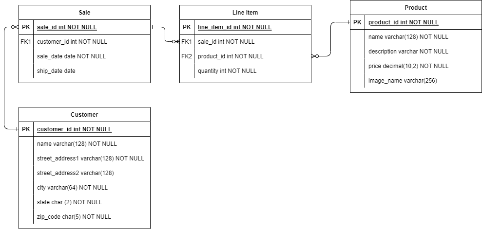

# Module Two mid-module project

The Module Two mid-module project offers the opportunity to apply the programming skills and knowledge you've learned up to now. In particular, you'll demonstrate the following:

* Write and execute SQL statements using SELECT, FROM, WHERE, and ORDER BY
* Use the JOIN clause to select data from more than one table
* Write SQL statements to add, modify and delete database rows
* Implement DAOs to facilitate interactions with a database
* Write integration tests for DAO methods

## Application

This application allows employees in an e-commerce company to manage customer, product, and sales data. For example, users can view a list of products in the application, and then choose to add, update, or delete the product data.

The [Requirements](#requirements) section later in this document describes more fully the application features.

## Database

Before running the application, create the `SSGeek` database. Be sure to match the capitalization shown, otherwise the application won't find the database. Find the `SSGeek.sql` script in the `database` folder. Run the script to create the database tables and populate them with some initial data. Confirm that the tables exist by opening SSGeek -> Schemas -> Tables. After successfully running the script you can find the `customer`, `line_item`, `product`, and `sale` tables inside.

Here is a drawing of the database schema. 

## Starting code

Once you have loaded the database, open the Module Two mid-module project in IntelliJ and review the starting code.

The project contains code defining the application's console user interface, including the required DAO interfaces and model classes. The code includes Javadoc comments to explain the purpose of the various classes and methods. 

Review the code provided, focusing on the following classes:

* `Application.java` - The "main" class of the application. Note the `TODO` comment indicating where to replace the `null` values.
* `ProductDao` - The interface for accessing product data, used by the application's "Product admin" menu.
* `SaleDao` - The interface for accessing the sales data, used by the application's "Sales admin" menu.
* `LineItemDao` - The interface for accessing the sale line item details, also used by the "Sales admin" menu.

## Requirements
 
 To make the application functional you must implement the DAO interfaces (`CustomerDao`,`ProductDao`,`SaleDao`,`LineItemDao`) and update the `Application` class to use them. 

### Customer Admin Feature

The application must allow a user to:
* list all customers
* view customer details
* add a customer
* modify customer details

The `CustomerDao` interface provides methods to support these functions. 

Create a `JdbcCustomerDao` class to implement this interface, writing tests to verify the method behavior. Then create an instance of the DAO in the `Application` class to make the "Customer admin" menu options functional.

### Product Admin Feature

The application must allow a user to:
* list all products
* view product details
* add a product
* modify product details
* remove a product

The `ProductDao` interface provides methods to support these functions. 

Create a `JdbcProductDao` class to implement this interface, writing tests to verify the method behavior. Then create an instance of the DAO in the `Application` class to make the "Product admin" menu options functional.

### Sales Admin Feature

The application must allow a user to:
* list all sales orders for a customer
* list all sales orders for a product
* ship a sales order
* cancel (remove) a sales order

The `SaleDao` interface provides methods to support the majority of the Sales Admin Features. 

Create a `JdbcSaleDao` class to implement this interface, writing tests to verify the method behavior. Then create an instance in the `Application` class to complete the "Sales admin" menu features.

The application must also allow a user to:
* view details of a sales order

The `LineItemDao` interface provides methods to support viewing the details of a sales order. 

Create a `JdbcLineItemDao` class to implement this interface, writing tests to verify the method behavior. Then create an instance in the `Application` class. Now the application is fully complete.
